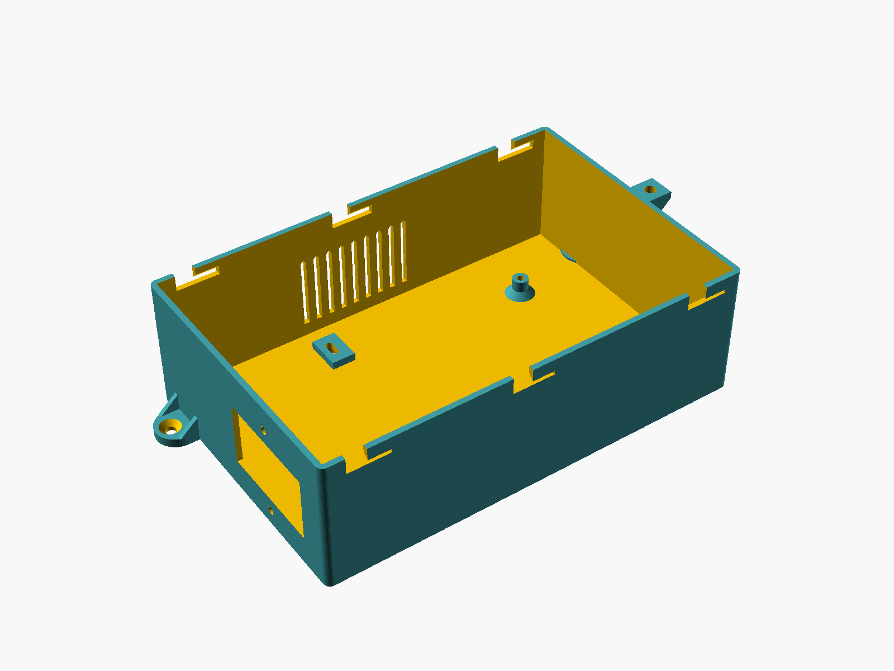
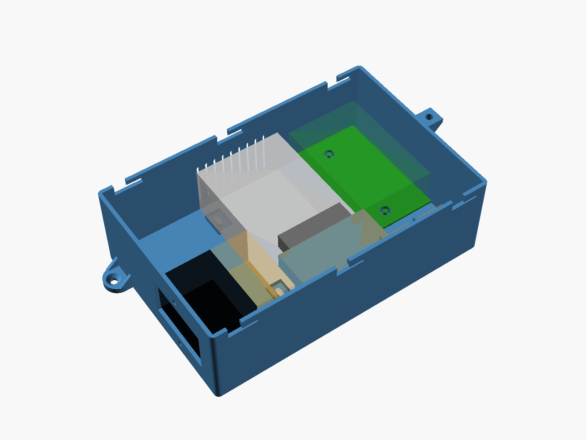
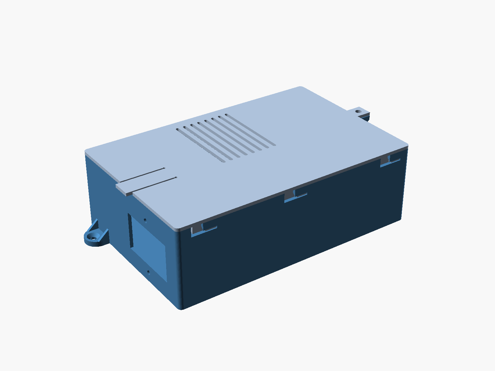
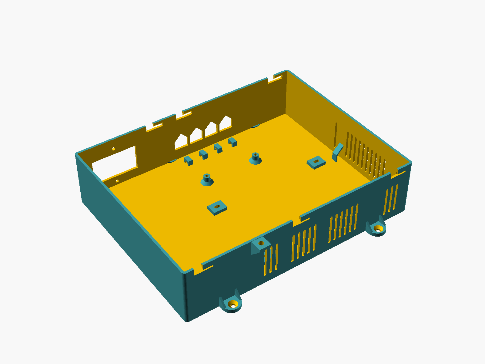
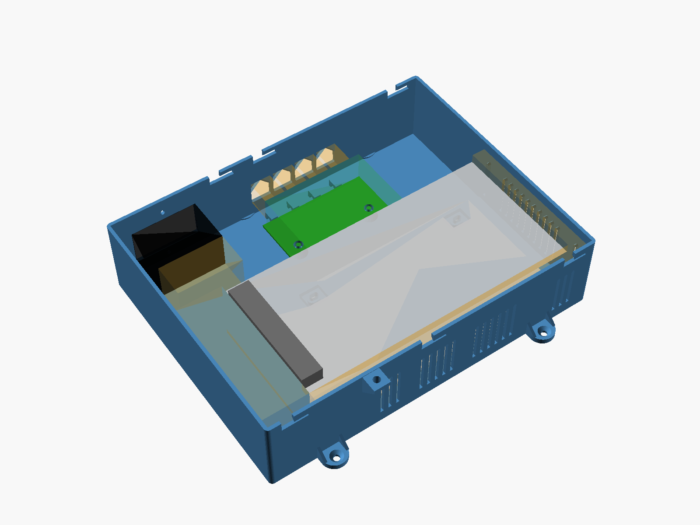
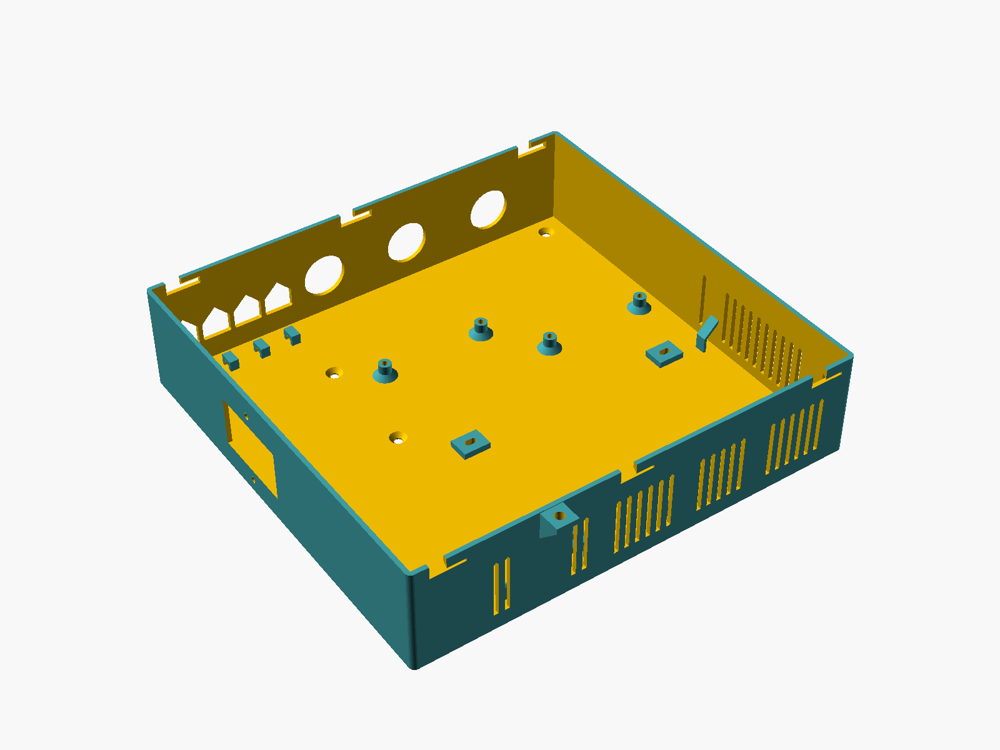
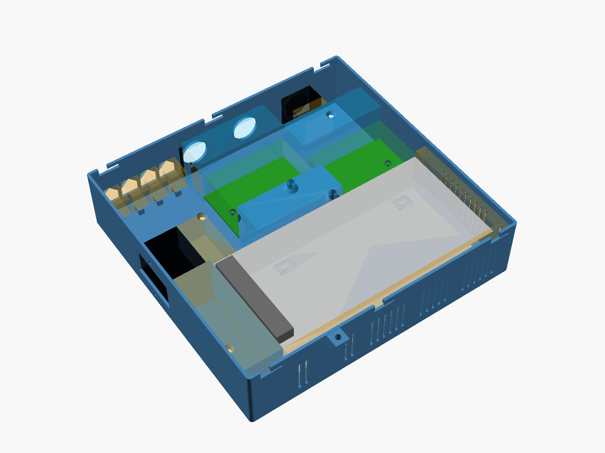
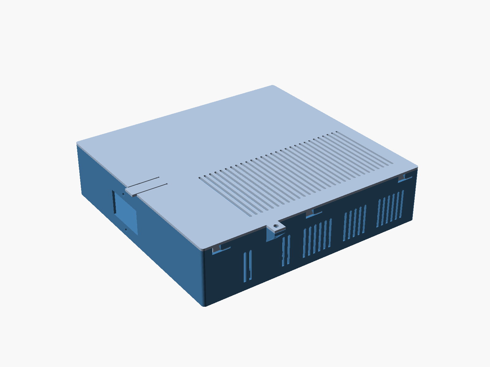

# electronics-enclosure

Parametric 3D-printed enclosures for mains-powered LED controllers. Each enclosure houses a
power supply, a C14 inlet, perfboards and connectors, and is generated from a YAML file of
measurements into ready-to-slice STLs: an open base and a tool-free sliding lid.

<!-- META-DOCS:BEGIN -->
## Documentation

The design of this project, and the reasoning behind it, lives in [`docs/`](docs/README.md) — a
recursive tree that mirrors the system part by part, down to individual behaviours, with every
decision recorded alongside the reason it was made. Start at the hub and navigate down.

These docs are written for LLM coding agents. Design changes are documented in the same commit that
makes them; see [`docs/CONVENTIONS.md`](docs/CONVENTIONS.md).
<!-- META-DOCS:END -->

## Enclosures

| Name | Power supply | Contents | Prints |
|---|---|---|---|
| [`20W`](enclosures/20W/BOM.md) | S-20-5 (5 V 4 A) | C14, 1 perfboard, 2 LED exits in the floor | base + lid on one A1 plate |
| [`100W`](enclosures/100W/BOM.md) | S-100-5 (5 V 20 A) | C14, 1 perfboard, 4 LED exits | base and lid separately |
| [`100W-rj45`](enclosures/100W-rj45/BOM.md) | S-100-5 | as 100W plus an RJ45 bulkhead | base and lid separately |
| [`100W-masterbox`](enclosures/100W-masterbox/BOM.md) | S-100-5 | C14, ESP32 board, MAX485 board, 3 RJ45, 4 LED exits | base and lid separately, fills the A1 bed |

Each enclosure's `BOM.md` shows renders of it (empty base, base with parts, closed) and lists its
printed parts, bolts and nuts, where supports may be needed, and what to check before printing.

| | Base, no lid | Base with parts | Closed |
|---|---|---|---|
| **20W** |  |  |  |
| **100W** |  |  |  |
| **100W-rj45** |  |  |  |
| **100W-masterbox** |  |  |  |

## Quick start

```bash
python3 -m venv .venv && .venv/bin/pip install -r requirements.txt
```

```bash
brew install --cask openscad@snapshot
```

```bash
.venv/bin/python build.py 100W
```

Outputs land in `enclosures/<name>/`:

- `stl/<name>-enclosure-base.stl`, `stl/<name>-enclosure-lid.stl` — already in print orientation;
  `stl/<name>-enclosure-plate.stl` too when both fit on one bed.
- `preview/*.png` — the box closed, open with its parts as coloured blocks, and empty.
- `BOM.md` — hardware, print notes, board-drilling positions for floor wire exits, checks.

`--check` validates a layout without rendering; with no name, every enclosure is built.
`--coupon jst-sm-3pin` writes a small test plate for trying a connector through its slot.

## How a box is put together

- **Power supply** bolts up through the floor into its own M3 threads.
- **Mains and low voltage never cross:** the C14 sits on the supply's AC side; low-voltage wires
  stay on the DC side or run through printed wire loops around the supply's far end.
- **Lid:** drops in 10 mm off-centre, slides shut and clicks. Lift the tab at the edge to open.
  A zip tie through the lock lugs keeps it shut.
- **Hardware:** M3 socket-head bolts and M3 hex nuts only, no heat-set inserts.
- **Print in PETG or ASA**, not PLA: the supply runs warm.

## Layout

| Path | What |
|---|---|
| `enclosures/<name>/enclosure.yaml` | one enclosure: interior size and where each part goes |
| `components/<kind>/<part>.yaml` | measured parts (PSUs, perfboard, panel connectors, pass-throughs), reused across enclosures |
| `config/defaults.yaml` | house style: walls, M3 hardware, lid, vents, mounting, printer bed |
| `enclosure_builder/` | Python: merge, layout, validation, BOM, OpenSCAD driver |
| `scad/enclosure.scad` | geometry library |
| `test-prints/` | small test-fit pieces |
| `docs/` | design decisions and their reasons |
