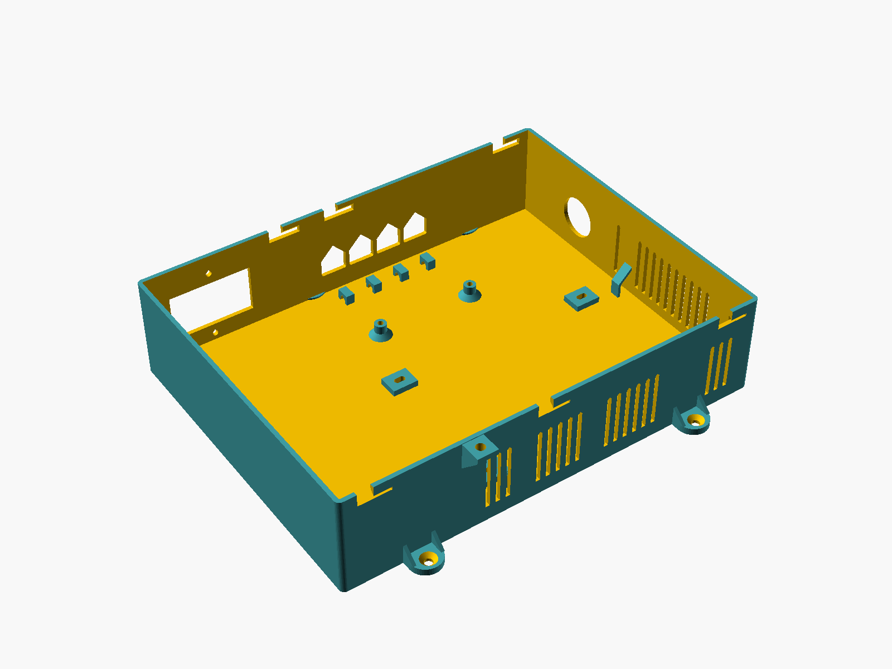
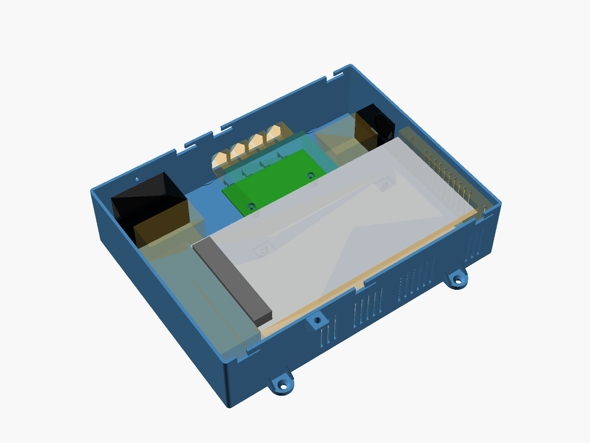
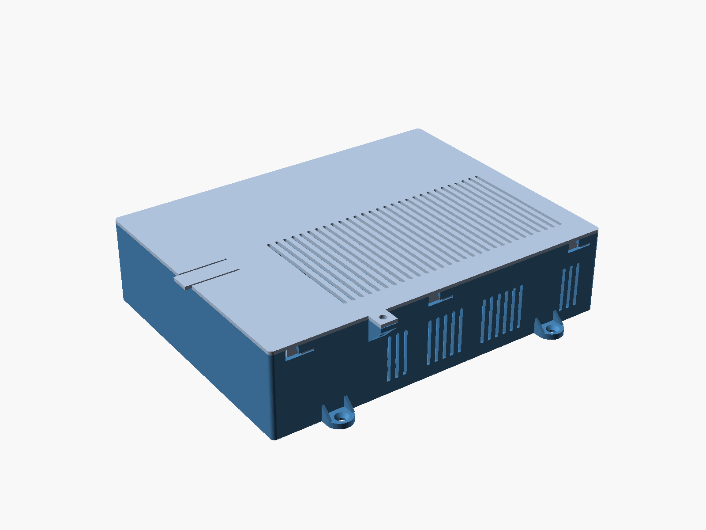

# 100W-rj45 — build sheet

GENERATED by `build.py` from `enclosure.yaml`. Do not edit; rebuild instead.

| Base, no lid | Base with parts, no lid | Closed |
|---|---|---|
|  |  |  |

Parts are drawn as blocks: grey PSU, green perfboards, black connector bodies; light blue is board clearance, orange is wiring space.

## Printed parts

| File | Print orientation | Size (x × y × z mm) | Supports |
|---|---|---|---|
| `stl/100W-rj45-enclosure-base.stl` | floor on the bed | 248.8 × 218.8 × 58.0 | c14-fuse-switch cutout: flat 47.5 mm top (bridge, or support if your slicer wants it); rj45-bulkhead hole: round 24 mm top (overhang; may want support) |
| `stl/100W-rj45-enclosure-lid.stl` | top face on the bed, lip up | 252.8 × 202.8 × 9.4 | none |

Bed: base leaves 5.2 mm spare on its tightest axis; lid leaves 1.2 mm spare on its tightest axis (256 x 256 bed, 2 mm margin kept).

Base and lid do not fit on one plate together; print them separately.

The lid needs no hardware: drop it in shifted toward the left wall, slide it right until the tab clicks. To open, lift the tab at the left edge and slide the lid left.

Print in PETG or ASA, not PLA: the PSU case runs warm at full load and PLA creeps under the bolted PSU pads.

## Hardware

| Qty | Item | Used for |
|---|---|---|
| 4 | M3 hex nut | 2 perfboard[0] dikavs-half, in pockets under the floor; 2 panel[0] c14-fuse-switch flange, inside |
| 2 | M3 x 10 socket head | 2 panel[0] c14-fuse-switch flange, head outside |
| 2 | M3 x 12 socket head | 2 perfboard[0] dikavs-half, from the top |
| 4 | M3 x 6 socket head | 4 psu s-100-5, from under the floor into the PSU (enters 3 mm — do not substitute a longer bolt) |
| 4 | screw, shank <= 4.2 mm, head <= 9 mm | 4 fixing the enclosure (user's choice of screw) |

## Interior

244 × 186 × 55 mm (L × W × H), wall 2.4 mm, floor 3.0 mm.

## Check before printing

Taken from datasheets, not measured on your parts:

- psu s-100-5: from Mean Well S-100F datasheet, case No. 902 (https://www.meanwell.com/Upload/PDF/S-100F/S-100F-SPEC.PDF) — bottom M3 holes 120 mm apart along the length and 80 mm across; nearest hole 62 mm from the terminal end
- jst-sm-3pin: from JST SM connector datasheet, housing drawings p.3 (https://www.jst-mfg.com/product/pdf/eng/eSM.pdf) — both housings pass the 15.6 x 10.2 mm slot without squeezing the latch flaps
- lid: back-wall tongue moved from u=22 to u=88 to clear other features
